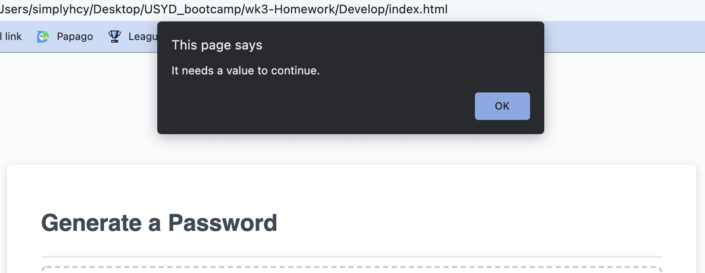

# Password Generator

Link: [Password Generator](https://etta0311.github.io/wk3-Homework/)

## Description

In this task, I am required to build up a password generator using javascript.
This task is provided with starter code and my own work focused on javascript file.
This generator will let users to generate a random password with their wanted parameters such as number, symbols, upper and lower case alphabet.
the task is quite straight forward and easy to build up with starter code.

## Table of Contents

   - Techniques used
   - Features
   - Contributors
   - Credits
   - License

## Techniques used

   Javascripts
   - If/ else statement
   - while loop
   - variables
   - queryselector
   - Alert message

## Features
   Click Generate password to start , pop up message shown
   

   Alert message pop up when no numbers entered/ not within 8 - 128 digits range
   
   

   Message asking for specific requirements for random password
   

   While loop used in task
   
## Contributors

   

## Credits
    - https://choosealicense.com/
    - https://www.w3schools.com/js/js_loop_while.asp
    - https://www.w3schools.com/jsref/jsref_if.asp

    
## License
MIT License

Copyright (c) [2021] [Ettaho]

Permission is hereby granted, free of charge, to any person obtaining a copy
of this software and associated documentation files (the "Software"), to deal
in the Software without restriction, including without limitation the rights
to use, copy, modify, merge, publish, distribute, sublicense, and/or sell
copies of the Software, and to permit persons to whom the Software is
furnished to do so, subject to the following conditions:

The above copyright notice and this permission notice shall be included in all
copies or substantial portions of the Software.

THE SOFTWARE IS PROVIDED "AS IS", WITHOUT WARRANTY OF ANY KIND, EXPRESS OR
IMPLIED, INCLUDING BUT NOT LIMITED TO THE WARRANTIES OF MERCHANTABILITY,
FITNESS FOR A PARTICULAR PURPOSE AND NONINFRINGEMENT. IN NO EVENT SHALL THE
AUTHORS OR COPYRIGHT HOLDERS BE LIABLE FOR ANY CLAIM, DAMAGES OR OTHER
LIABILITY, WHETHER IN AN ACTION OF CONTRACT, TORT OR OTHERWISE, ARISING FROM,
OUT OF OR IN CONNECTION WITH THE SOFTWARE OR THE USE OR OTHER DEALINGS IN THE
SOFTWARE.
